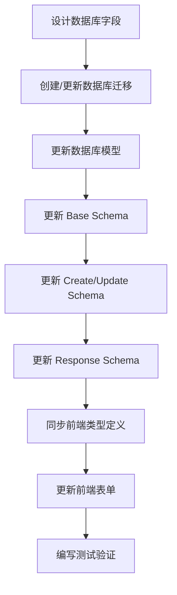

# 前后端开发最佳实践

本文档旨在帮助团队避免前后端字段不一致、Schema定义不完整等问题。

## 问题回顾

### 常见问题
1. **字段名不一致**：前端使用 `dept_code`，后端使用 `code`
2. **Schema定义不完整**：后端 Schema 缺少数据库模型中存在的字段（如 `remark`）
3. **类型定义不同步**：前端 TypeScript 类型与后端 Pydantic Schema 不一致

## 解决方案

### 1. 统一的字段命名规范

#### 原则
- **后端优先**：后端 Schema 定义的字段名为标准
- **前端适配**：前端表单字段名应与后端 Schema 一致
- **避免映射**：尽量减少字段名映射，减少出错概率

#### 规范建议
```python
# 后端 Schema (标准)
class DepartmentBase(BaseModel):
    code: str          # 使用简洁的字段名
    name: str
    sort: int
    remark: str        # 基础字段
```

```typescript
// 前端类型定义（与后端一致）
export interface Department {
  code: string;       // 直接使用 code，不要用 dept_code
  name: string;       // 直接使用 name，不要用 dept_name
  sort: number;       // 直接使用 sort，不要用 sort_order
  remark?: string;
}
```

### 2. Schema 完整性检查清单

#### 开发流程
1. **数据库模型 → Schema → 前端类型**：按顺序定义，确保一致性

2. **添加新字段时的检查清单**：
   ```
   □ 数据库模型已添加字段
   □ Base Schema（DepartmentBase）已添加字段
   □ Create Schema（DepartmentCreate）继承或包含字段
   □ Update Schema（DepartmentUpdate）包含字段
   □ Response Schema（DepartmentResponse）包含字段
   □ 前端类型定义（Department, DepartmentCreate, DepartmentUpdate）已同步
   □ API 测试验证字段可用
   ```

3. **Schema 定义原则**：
   - 所有继承自 `BaseModel` 的字段应在 Base Schema 中定义
   - Update Schema 应为所有字段提供 Optional 版本
   - Response Schema 应包含所有需要返回给前端的字段

### 3. 自动化工具和检查

#### 3.1 代码检查脚本

创建检查脚本确保 Schema 完整性：

```python
# scripts/check_schema_completeness.py
"""
检查 Schema 完整性：
1. 检查 BaseModel 的所有字段是否在 Schema 中定义
2. 检查 Update Schema 是否包含所有 Base 字段
"""
```

#### 3.2 类型生成工具

**推荐方案**：
- 使用 OpenAPI/Swagger 自动生成前端类型
- 后端 FastAPI 自动生成 OpenAPI 文档
- 使用工具（如 `openapi-typescript`）从 OpenAPI 生成 TypeScript 类型

### 4. 开发流程改进

#### 4.1 添加新字段的标准流程



#### 4.2 Code Review 检查点

**后端 Review**：
- [ ] 所有 BaseModel 字段是否都在 Base Schema 中定义？
- [ ] Update Schema 是否包含所有可更新字段？
- [ ] 字段名是否符合命名规范（简洁、一致）？

**前端 Review**：
- [ ] TypeScript 类型是否与后端 Schema 一致？
- [ ] 表单字段名是否与后端 Schema 字段名一致？
- [ ] 是否有多余的字段映射逻辑？

### 5. 测试策略

#### 5.1 Schema 验证测试

```python
# tests/test_schemas/test_department_schema.py
def test_department_schema_has_all_base_fields():
    """确保 Department Schema 包含所有 BaseModel 字段"""
    from app.models.department import Department
    from app.schemas.department import DepartmentBase
    
    # 检查 BaseModel 字段
    base_fields = set(Department.__table__.columns.keys())
    schema_fields = set(DepartmentBase.model_fields.keys())
    
    # BaseModel 字段应在 Schema 中
    missing_fields = base_fields - schema_fields
    assert not missing_fields, f"Missing fields in schema: {missing_fields}"
```

#### 5.2 前后端字段一致性测试

```python
# tests/integration/test_field_consistency.py
def test_api_response_fields_match_schema():
    """确保 API 返回的字段与 Schema 定义一致"""
    # 创建测试数据
    # 调用 API
    # 验证响应字段
```

### 6. 文档规范

#### 6.1 Schema 注释规范

```python
class DepartmentBase(BaseModel):
    """Base department schema.
    
    注意：所有继承自 BaseModel 的字段都应在此定义，
    包括：id, remark, created_at, updated_at 等
    """
    # 业务字段
    code: str = Field(..., description="部门编码")
    name: str = Field(..., description="部门名称")
    
    # BaseModel 字段（已继承，但应在文档中说明）
    # remark: Optional[str] - 继承自 BaseModel
```

#### 6.2 API 文档

- 使用 FastAPI 自动生成的 OpenAPI 文档
- 确保所有字段都有清晰的 description
- 定期审查文档确保准确性

### 7. 迁移指南

#### 修复现有字段不一致问题

1. **选择标准字段名**（建议使用后端 Schema 字段名）
2. **逐步迁移**：
   - 后端保持兼容（同时接受新旧字段名）
   - 前端逐步迁移到新字段名
   - 删除兼容代码

#### 使用 Pydantic Field alias

```python
class DepartmentBase(BaseModel):
    code: str = Field(..., alias="dept_code")  # 同时支持 code 和 dept_code
    name: str = Field(..., alias="dept_name")
    
    class Config:
        populate_by_name = True  # 允许同时使用字段名和别名
```

### 8. 工具推荐

#### 8.1 代码生成工具

- **openapi-typescript-codegen**: 从 OpenAPI 生成 TypeScript 客户端
- **pydantic-to-typescript**: 从 Pydantic 模型生成 TypeScript 类型

#### 8.2 代码检查工具

- **mypy**: Python 类型检查
- **eslint**: TypeScript 代码检查
- **pre-commit hooks**: Git 提交前自动检查

## 缓存使用规范

### 何时使用缓存

✅ **适合缓存的数据**:
- 读多写少的数据（如部门、菜单、字典等）
- 查询频率高的数据
- 数据变更不频繁的数据

❌ **不适合缓存的数据**:
- 实时性要求极高的数据（如在线用户数）
- 写多读少的数据
- 数据量非常大的列表（考虑分页）

### 缓存实现规范

1. **缓存键设计**:
   - 使用有意义的键名：`{module}:{type}:{identifier}`
   - 支持多租户隔离：`dept:list:{tenant_id}`
   - 避免键名冲突：使用模块前缀

2. **缓存更新策略**:
   - 采用"写时清除"策略，确保数据一致性
   - 数据变更时立即清除相关缓存
   - 不依赖过期时间，避免脏数据

3. **错误处理**:
   - Redis连接失败时自动降级到数据库查询
   - 缓存操作异常不应影响业务流程
   - 记录警告日志，便于排查问题

4. **参考实现**:
   - 查看 [部门缓存方案](./DEPARTMENT_CACHE_GUIDE.md) 了解完整实现

## 总结

避免类似问题的关键：
1. **统一命名规范**：后端 Schema 为权威来源
2. **完整定义**：确保所有字段都在 Schema 中定义
3. **自动化检查**：使用工具和测试确保一致性
4. **清晰流程**：标准化的开发和 Code Review 流程
5. **持续维护**：定期审查和更新文档
6. **合理使用缓存**：对频繁查询的数据使用缓存，提升性能

## 参考

- [FastAPI 文档 - Schema](https://fastapi.tiangolo.com/tutorial/body/)
- [Pydantic 文档](https://docs.pydantic.dev/)
- [TypeScript 最佳实践](https://www.typescriptlang.org/docs/handbook/declaration-files/do-s-and-don-ts.html)
- [部门缓存方案](./DEPARTMENT_CACHE_GUIDE.md) - 部门数据Redis缓存实现指南

